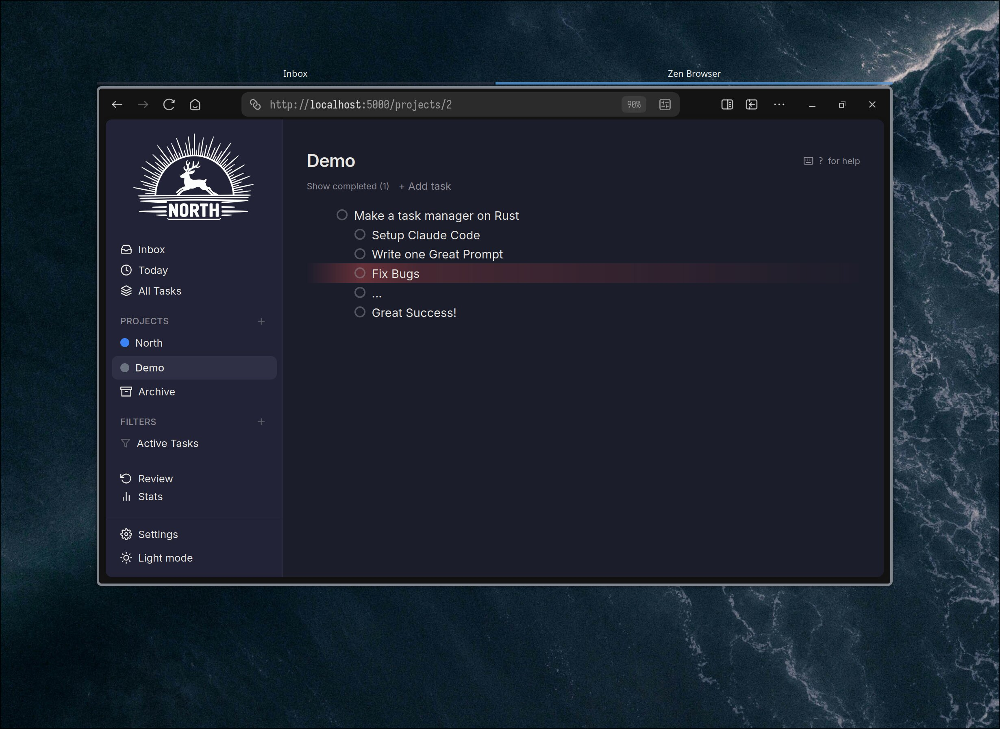

# North



A self-hosted, GTD-inspired task management system built entirely in Rust. North combines a full-stack Rust architecture with practical Getting Things Done workflows — sequential subtask execution, structured review cycles, and a powerful query language for filtering tasks.

## Features

- **Inbox & Today views** — capture tasks quickly, then focus on what's actionable today
- **Sequential subtasks** — configurable N-next visibility so you only see the tasks you should work on now
- **GTD review cycles** — per-task review tracking with configurable intervals to keep your system current
- **Projects & tags** — organize work with colored projects (list or kanban view) and user-defined tags
- **Filter DSL** — JQL-like query language with autocomplete for building saved filters (`status = 'ACTIVE' AND tags =~ 'work:*' ORDER BY due_date ASC`)
- **Inline parsing** — type `#tag` or `@project` directly in task titles to assign tags and projects on the fly
- **Markdown support** — full CommonMark rendering in task descriptions with image uploads
- **Drag and drop** — reorder tasks, nest subtasks, and assign to projects by dragging
- **Dark & light themes** — respects system preference with manual toggle
- **REST API** — full CRUD API for external integrations alongside the web UI
- **Single binary** — one Rust binary serves both the server-rendered pages and the WASM-hydrated client

## Tech Stack

North is a full-stack Rust application — no JavaScript runtime, no Node.js, no npm.

| Layer | Technology |
|---|---|
| Language | **Rust** (stable, edition 2021) |
| Frontend | [Leptos](https://github.com/leptos-rs/leptos) 0.7 (SSR + WASM hydration) |
| Backend | [Axum](https://github.com/tokio-rs/axum) |
| Database | PostgreSQL 17 via [Diesel](https://diesel.rs/) (async) |
| Styling | TailwindCSS 4 |
| Cache | Redis 7 (reserved for future use) |
| Auth | JWT (httpOnly cookies) with Argon2 password hashing |

## Quick Start

### Prerequisites

- Docker & Docker Compose

### Running with Docker Compose

```bash
# Clone the repository
git clone https://github.com/zorya-development/north.git
cd north

# Build and start all services
docker compose up -d

# Run database migrations and seed the admin account
docker compose exec app just migrate
docker compose exec app just seed
```

The application will be available at **http://localhost:5000**.

Default admin credentials: `admin@north.local` / `admin`

> There is no self-registration. The admin account creates all other users.

---

## Development

### Prerequisites

- Docker & Docker Compose

### Setup

```bash
# Build the base and dev images
docker compose build

# Start the database and Redis
docker compose up -d db redis

# Enter the app container
docker compose run --rm -ti --service-ports app bash

# Inside the container:
just migrate          # Apply database migrations
just seed             # Seed admin account
just dev              # Start dev server with hot reload
```

### Commands

All commands run inside the app container via [just](https://github.com/casey/just):

| Command | Description |
|---|---|
| `just dev` | Dev server with hot reload (cargo-leptos) |
| `just test` | Run all tests |
| `just test crate_name` | Run tests for a specific crate |
| `just fmt` | Format code |
| `just lint` | Run clippy |
| `just check` | fmt + lint + test |
| `just migrate` | Apply database migrations |
| `just migration name` | Create a new migration |
| `just migrate-revert` | Revert last migration |
| `just migrate-redo` | Revert + reapply last migration |
| `just build` | Release build |
| `just seed` | Seed admin account |

For CI or non-interactive use: `docker compose exec app just <command>`

### Project Structure

North is organized as a Cargo workspace with layered crates:

```
north/
├── crates/
│   ├── dto/            # Shared data types (no IO) — compiled for server and WASM
│   ├── db/             # Diesel schema, models, connection pool
│   ├── core/           # Business logic, services, filter DSL engine
│   ├── server-fns/     # Leptos #[server] RPC boundary
│   ├── repositories/   # Thin async facade over server functions
│   ├── stores/         # Reactive client state (signals, memos, optimistic updates)
│   ├── ui/             # Generic UI component library (no domain deps)
│   ├── app/            # Leptos pages, containers, components (SSR + WASM)
│   └── server/         # Axum binary, REST API, auth middleware
├── migrations/         # Diesel reversible migrations (up.sql + down.sql)
├── style/              # TailwindCSS entry point
├── public/             # Static assets
├── docker/             # Base, dev, and prod Dockerfiles
└── docs/               # Product requirements and design system
```

Data flows through the layers in one direction:

```
Page → Store → Repository → ServerFn ──RPC──→ Service → Diesel → PostgreSQL
```

### Docker Images

| Image | Path | Purpose |
|---|---|---|
| **base** | `docker/base/Dockerfile` | Rust toolchain, cargo-leptos, diesel_cli, wasm32 target |
| **dev** | `docker/dev/Dockerfile` | Extends base — adds just and tailwindcss CLI |
| **prod** | `docker/prod/Dockerfile` | Runtime-only: debian:bookworm-slim with pre-built binary |

Base image version is tracked in `docker/base/VERSION`. Bump with:

```bash
just bump-base patch    # 1.0.0 → 1.0.1
just bump-base minor    # 1.0.0 → 1.1.0
just bump-base major    # 1.0.0 → 2.0.0
```

### CI/CD

- **test.yml** — runs on pushes to master and all PRs: format check, clippy, tests. Conditionally rebuilds the base image if `docker/base/**` changed.
- **release.yml** — runs on pushes to master: builds a production Docker image, pushes to ghcr.io, generates a changelog via git-cliff, and creates a GitHub release.

### Releasing

1. Bump version: `just bump-version {major,minor,patch}`
2. Push to master (via PR or direct push)
3. The release workflow automatically builds and publishes the Docker image, changelog, and GitHub release

---

## License

Proprietary — Zorya Development
